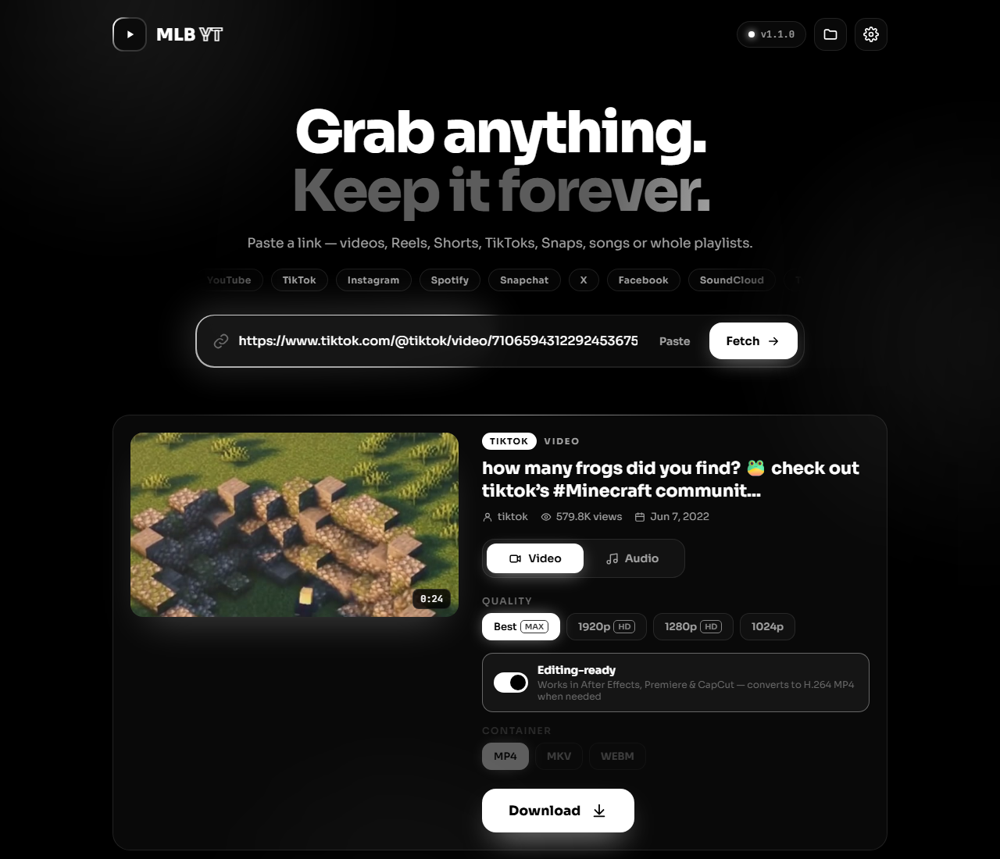
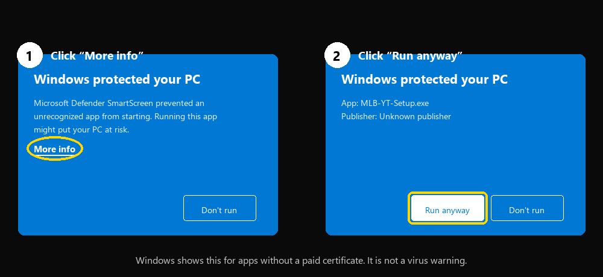

<picture>
  <source media="(prefers-color-scheme: light)" srcset="assets/icon-black.png">
  
</picture>

# MLB YT

**Download videos & music from anywhere. One paste, one click.** 🎬🎵

  

---

## ⬇️ Install (1 minute)

**1.** **[Click here to download MLB-YT-Setup.exe](https://github.com/MSEVENDEV/mlb-yt/releases/latest/download/MLB-YT-Setup.exe)**, then open the downloaded file.

**2.** Windows shows a blue box. Click **More info**, then **Run anyway**:

**3.** Click **Next** → tick **I accept** → **Next** → **Install** → **Finish** 🎉

That's it — MLB YT is on your desktop, and **it updates itself** from now on. 🔄

---

## ✨ Features

| | |
|---|---|
| 🌍 **Any site** | YouTube, TikTok, Instagram, Snapchat, X, Facebook, SoundCloud, Twitch, Reddit and **1,700+ more** |
| 🎵 **Spotify** | Songs, albums and playlists saved as MP3 with the real title, artist and cover art, 4 songs at a time |
| 🎬 **Editing-ready** | Videos open straight in **After Effects, Premiere and CapCut**: H.264, or **ProRes** for 100% After Effects-proof files |
| 🛠️ **Fix old videos** | Turn videos you already have into editing-ready copies in one click |
| 📺 **Any quality** | From 144p up to 4K / 8K, as MP4, MKV or WEBM |
| 🎧 **Audio only** | MP3 320k, M4A, OPUS, FLAC or WAV |
| 📚 **Playlists** | A whole YouTube playlist or Spotify album in one click |
| 🔐 **Private posts** | Optional sign-in (Firefox or a cookies.txt file) for private or age-restricted links |
| ⚡ **Fast** | 3 downloads at once, anti-throttle downloading, smart retries, live speed and time left |
| 🔄 **Auto-updates** | The app and its download engine keep themselves up to date, and every app update is digitally signed |
| 🖤 **Clean design** | Animated black and white interface, drag and drop, <kbd>Ctrl</kbd>+<kbd>V</kbd> to paste |

---

## 🕹️ How to use

1. **Copy** a link (from YouTube, TikTok, Instagram, Spotify…)
2. **Open MLB YT** and press <kbd>Ctrl</kbd>+<kbd>V</kbd>. It loads by itself
3. Pick **Video** or **Audio** and a quality, then hit **Download** ⬇️

📁 Files go to **Downloads → MLB YT**. You can change the folder in ⚙️ **Settings**.

---

## 🛡️ Safe & private

- 💻 Runs **only on your PC**: no account, no ads, no tracking
- ✍️ Updates are **digitally signed**, and the app refuses anything that isn't
- 🧱 Websites can't control the app, and it only ever opens media files
- 📦 Everything it needs is included, so there's nothing else to install

---

## ❓ Help

<b>"Windows protected your PC" when installing</b>
 
Click <b>More info</b> → <b>Run anyway</b> (see the picture above). Windows shows this for every app that doesn't
have a paid code-signing certificate. It isn't a virus warning, and it disappears once the app is installed.

<b>"Could not copy Chrome cookie database"</b>
 
Nothing is broken: that only means the optional <b>sign-in</b> couldn't read your browser cookies, and downloads
keep working without it. Chrome and Edge lock and encrypt their cookies, so either switch it <b>Off</b> in
⚙️ Settings, or pick a <b>cookies.txt</b> file there (export one with a "get cookies.txt" browser extension).
You only need a sign-in for private or age-restricted links.

<b>A link doesn't work</b>
 
First, make sure the link is complete — links copied halfway are the most common cause. 
Otherwise close and reopen the app (it keeps its download engine up to date by itself), or open
⚙️ <b>Settings → Update yt-dlp</b>.

<b>No picture in After Effects / Premiere</b>
 
Keep <b>Editing-ready</b> on and pick <b>ProRes</b>. For videos you already have, click <b>Fix a video for editing</b>. 
In After Effects, delete the old clip from the project before importing the new one, because it remembers old files by name.

<b>How do I update?</b>
 
You don't have to. When there's a new version, a white <b>Update</b> button appears at the top of the app. One click and it's done.

<b>How do I uninstall?</b>
 
Windows <b>Settings → Apps → MLB YT → Uninstall</b>. Your downloaded files are kept.

---

<a href="https://github.com/MSEVENDEV">
  <picture>
    <source media="(prefers-color-scheme: light)" srcset="assets/author-black.png">
    
  </picture>
</a>

**Designed & built by [MSEVENDEV](https://github.com/MSEVENDEV)**

© 2026 MSEVENDEV · All rights reserved · <a href="LICENSE">License</a> · <a href="THIRD-PARTY-NOTICES.txt">Credits</a> 
Only download content you own or have permission to save.

